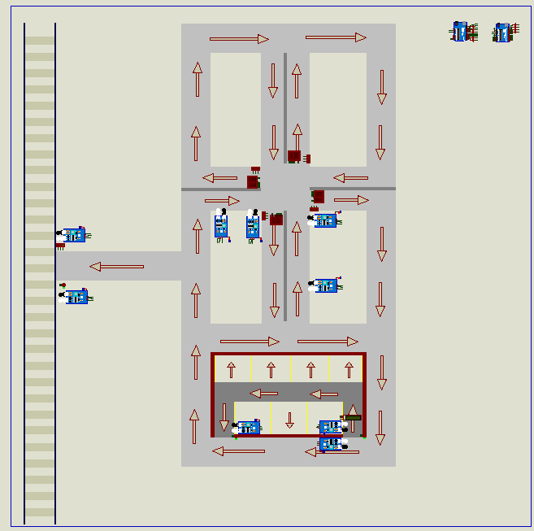
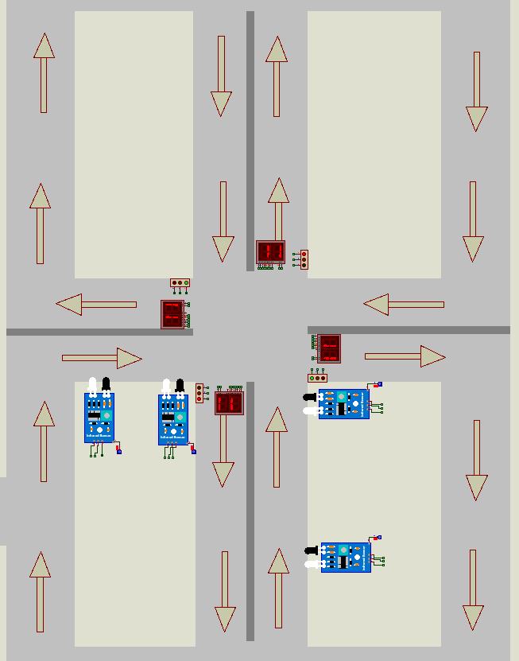
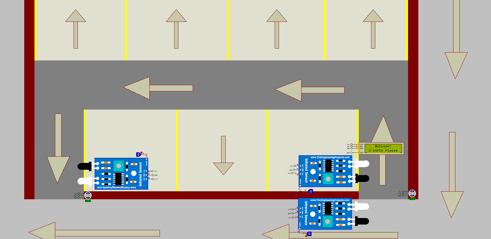
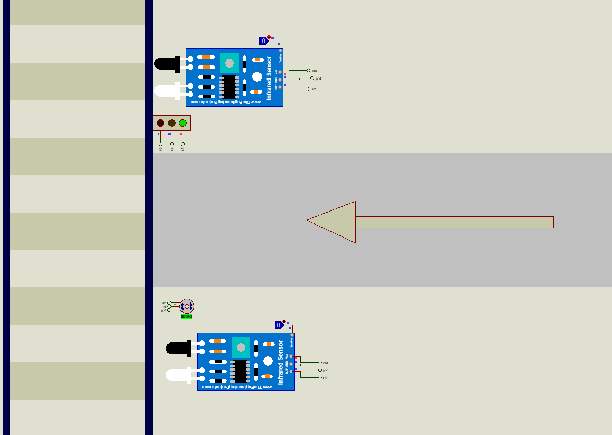

# Smart Traffic & Parking Management System 🚦🅿️  

## 📝 Overview  
This project is an **Arduino-based system** designed to manage **smart traffic signals, parking management, and railway gate control**.By optimizing resource utilization in the code, the system minimizes reliance on additional physical tools and reduces project costs.

## 🚀 Features  
- 🚦 **Smart Traffic Signals**: By analyzing traffic conditions, the system manages signal durations to enhance road efficiency and minimize congestion. 
- 🅿️ **Parking Management**: Parking Management: Controls entry and exit gates while displaying real-time availability of parking spaces on an LCD display.
- 🚉 **Railway Gate Control**: Efficient and safe railway crossing management.  
- ⚡ **Optimized Performance**: Reduced physical hardware needs through effective C++ programming.  

## 🛠️ Technologies Used  
- 🔹 **C++**: Core programming language for embedded system development.  
- 🔹 **Arduino**: Microcontroller used for implementing the system.  
- 🔹 **Hardware Components**: The system integrates IR sensors for detection, a 7-segment display for numerical output, a servo motor for gate control, and an LCD display for real-time status updates.  

## 📖 Usage  
For details on how to use the system, please refer to **[USAGE.md](USAGE.md)**.  

## 📸 Project Images

### Full System

### Smart Traffic System

### Parking Management

### Railway Gate Control

